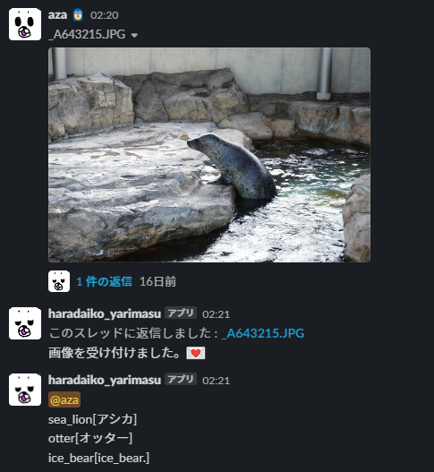

# image-machine-learning-via-slack

## 概要
機械学習の動きを、学習済みモデル（VGG16）とコミュニケーションツールであるSlackを用いて簡単に体験することができます。  
利用者がSlackの特定のチャンネルに投稿した画像データを読み取り、VGG16を用いてそれが何を表す画像なのかを予測し、予測結果を利用者に返します。  

学習済みデータを変更するなど様々な他の遊び方もできます。

他人に使ってもらうことが前提であるため、UXやtokenの扱いについて自分なりに注意して開発しました。

 

## 作ってみた感想等

ブログにて作成中📝

## Versions of Python packages
- googletrans 4.0.0rc1
- numpy 1.21.2
- Pillow 9.0.0
- pip 21.3.1
- requests 2.26.0
- slack-sdk 3.8.0
- tensorflow 2.7.0

## 謝辞
- このプロジェクトは、以下のライセンスが適用されているソフトウェアを利用しています。
    - [NOTICE.md](NOTICE.md)