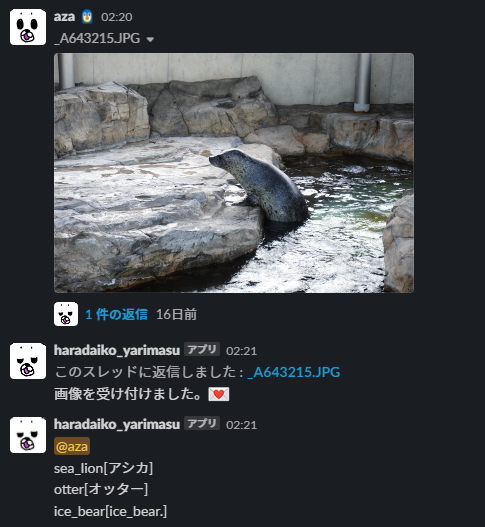

# image-machine-learning-via-slack

## Summary
You can experience how machine learning works easily via VGG16, a trained model, and Slack, a communication platform.  
Get an image posted at Slack's particular channel by a user predict what is it with VGG16 and return a result of prediction to the user.

You can have other fun with this, such as changing a trained model.
  
Because I have developed it assuming that used by someone, I paid attention to UX and handling tokens.

 

## Versions of Python packages
- googletrans 4.0.0rc1
- numpy 1.21.2
- Pillow 9.0.0
- pip 21.3.1
- requests 2.26.0
- slack-sdk 3.8.0
- tensorflow 2.7.0

## Acknowledgements
- This project utilizes Software that is under some licenses.
    - [NOTICE.md](NOTICE.md)